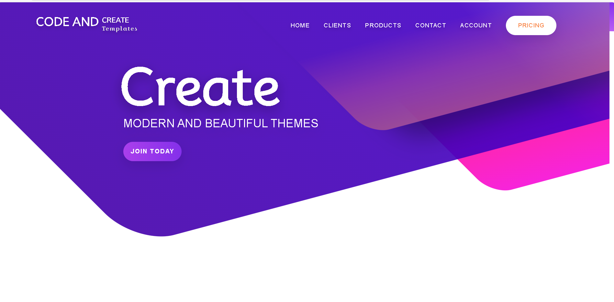

Responsive Web Design Project
This project is a modern, responsive web design built using HTML5, CSS3, and JavaScript.

Features
Compatible with mobile, tablet, and desktop devices

Clean, modern user interface

Clean and readable code structure

Responsive layout adapts smoothly to different screen sizes

Optimized for performance and user experience

Technologies Used
HTML5

CSS3 (Flexbox and Grid systems)

JavaScript (Vanilla JS)

Screenshots
Here are some screenshots showing the project on different devices:

